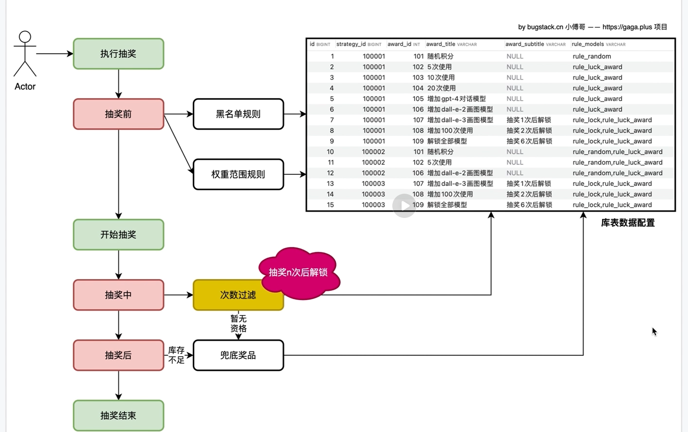
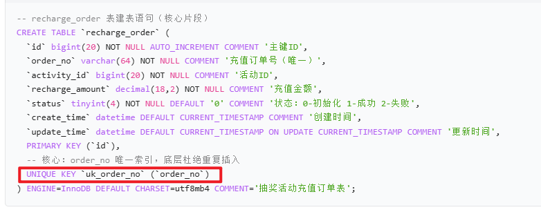
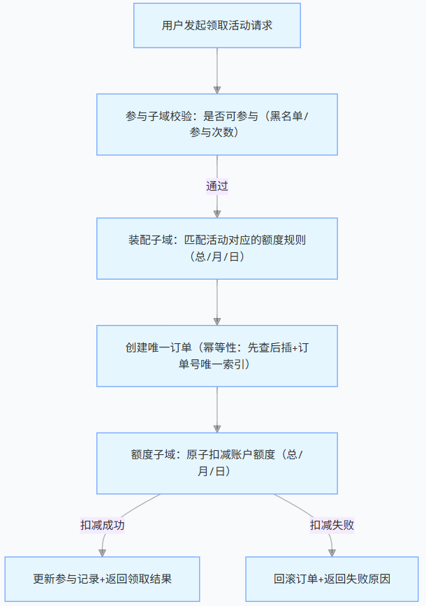
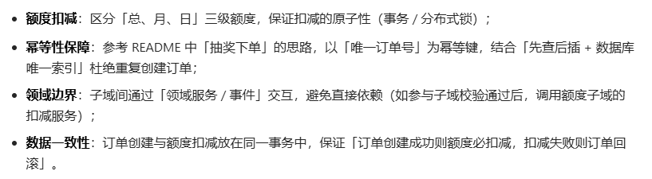

strategyId==抽奖活动id
---
---
抽奖业务
---
第三节工作:
---
1、通过查询奖品列表，获取概率参数（最小概率，概率总和，各个奖品的范围）
***
2、创建ArrayList数组的奖品概率表（添加高效，适合按概率重复填充奖品id）
***
3、查找表的逻辑：按概率生成有序的奖品概率表--乱序-按索引转换键值对
***
第四节：抽奖前处理（实现类似于保底机制）
---
1、抽奖前先进行规则处理，一、黑名单，直接放回设定好的抽奖结果，二、幸运值权重，要幸运值大于数据库配置好的才能走这个规则，三、无额外规则
***
2、通过库表查询幸运值
***
2、把库表配置的奖品装配，没有配置到的奖品去掉

***
第五节：抽奖中
---
1、设定抽奖中规则：用户抽奖n次后，对应奖品可抽奖
***
2、查询奖品规则「抽奖中（拿到奖品ID时，过滤规则）、抽奖后（扣减完奖品库存后过滤，抽奖中拦截和无库存则走兜底）」
***
第六节：优化抽奖前流程
---
1、设置责任链，保证抽奖前顺序能按照责任链中节点走下去
***
2、在责任链中配置各种抽奖前流程：黑名单、权重抽奖、兜底规则
***

第七节：抽奖规则树模型结构
---
1、设置责任链，保证抽奖前顺序能按照责任链中节点走下去
***
2、在责任链中配置各种抽奖前流程：黑名单、权重抽奖、兜底规则
***
第八节：库存不超卖
---
1、把库存存到缓存中，避免数据库竞争，耗完连接池
***
2、用decr实现库存减操作，把减完的库存拼接成key，用setnx实现加锁
***
3、减库存成功后，写入延迟队列，延迟消费更新数据库数据
***
3.1定义缓存的key，获取一个阻塞队列，把阻塞队列包装成延时队列
***
3.2消费队列：用一样的key，适用poll从队列中取出消息

***
第9节：实现抽奖下单对活动账户充值的操作流程，把数据写入到库中，并可以保证幂等性。
---
以唯一订单号为幂等键，通过 “先查后插”+ 数据库唯一索引防重复，通过事务保证 “订单 - 账户” 数据一致性，通过订单状态闭环覆盖全流程。
***
幂等性保证:代码上：先查询订单是否存在，存在则直接返回结果，避免重复执行业务；
***
数据库层：recharge_order 表的 order_no 加唯一索引，即使并发请求，也只有一个请求能插入订单，其余请求会触发唯一键异常，从底层杜绝重复。

***
第10节：拆分活动领域为额度子域、参与子域、装配子域，完成用户领取活动，创建订单扣减账户（总、月、日）额度
---
具体流程：
***
额度扣减：区分「总、月、日」三级额度，保证扣减的原子性（事务 / 分布式锁）；
幂等性保障：参考 README 中「抽奖下单」的思路，以「唯一订单号」为幂等键，结合「先查后插 + 数据库唯一索引」杜绝重复创建订单；
领域边界：子域间通过「领域服务 / 事件」交互，避免直接依赖（如参与子域校验通过后，调用额度子域的扣减服务）；
数据一致性：订单创建与额度扣减放在同一事务中，保证「订单创建成功则额度必扣减，扣减失败则订单回滚」。
